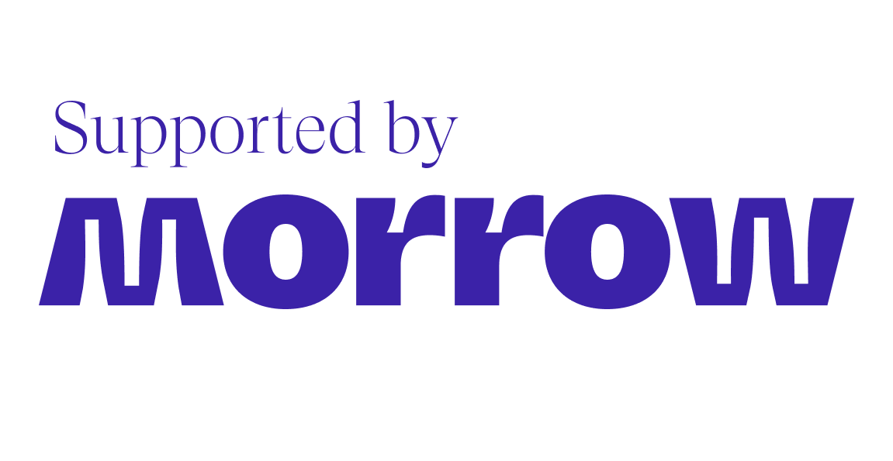

  

# ViroReact

ViroReact is a library for developers to rapidly build augmented reality (AR) and virtual reality (VR) experiences. Developers write in React Native, and Viro runs their code natively across all mobile VR (including Google Daydream, Samsung Gear VR, and Google Cardboard for iOS and Android) and AR (iOS ARKit and Android ARCore) platforms.

<table>
  <tr>
    <td align="center">
      
    </td>
    <td align="center">
      
    </td>
  </tr>
</table>

# [Installing](readmes/INSTALL.md)

If you are integrating ViroReact into an existing project, have a look at our [Installation instructions](readmes/INSTALL.md). Please note that this does _not_ work with Expo Managed Workflows. Sorry!

If you are starting a fresh project with ViroReact, consider cloning our [starter kit](https://github.com/ViroCommunity/starter-kit) repo instead.

# Documentation

The documentation is found [here](https://viro-community.readme.io/docs/overview). Currently, the documentation is migrated with issues to code samples and broken links. If you would like to help fix these issues, either submit an edit or [get in touch](https://discord.gg/H3ksm5NhzT)!

# FAQ

- _Older versions couldn't be submitted to Apple's app store due to use of `UIWebView`. Is this still a problem?_

  Reliance on `UIWebView` has been removed from the project, so you should not have this problem if using the `@viro-community/react-viro` package.

# Examples

See our [Example projects](readmes/EXAMPLES.md) page. These are a little old (~2019) but are a great reference point for how to use bits of the library.

# Need help? Or want to contribute?

# A little history...

ViroReact was originaly developed by the [Viro Media](http://www.viromedia.com/) company, but was open sourced in 2019. In late 2020 the [Viro Community](https://virocommunity.github.io/) was formed to help maintain and move the project onwards, updating it so it could run with modern versions of react native, and start to add in new features.

We, as a community, owe a great debt to Viro Media and the people who developed this library originally. We hope to make them proud as it continues to develop and grow in the Viro Community.

# Supporters

  

